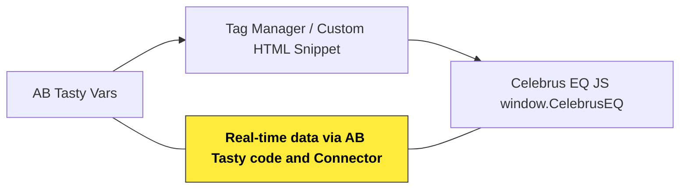

# AB Tasty → Celebrus Integration
## Overview

This integration captures AB Tasty experiment exposures and pushes them to the **Celebrus Data Collection platform** using template variables. It is designed for use in tag managers or other environments where AB Tasty template variables are available (`{{campaignId}}`, `{{campaignName}}`, etc.). It ensures **real-time data capture**, linking AB Tasty campaigns to Celebrus sessions for downstream analytics and personalisation.


## Prerequisites

- AB Tasty implemented with template variables accessible in your environment.  
- Celebrus **Data Collection for HTML5** library loaded (`window.CelebrusEQ` available).  
- Basic knowledge of JavaScript or tag manager usage.  
- Optionally, a **consent management solution** to respect visitor privacy regulations.


## Template Variables

| Variable          | Description                           | Example                          |
|------------------|---------------------------------------|----------------------------------|
| `{{campaignId}}`    | AB Tasty experiment ID                | `12345`                          |
| `{{campaignName}}`  | AB Tasty experiment name              | `"Homepage Hero Test"`          |
| `{{variationId}}`   | AB Tasty variant bucket ID            | `B`                              |
| `{{variationName}}` | AB Tasty variant display name         | `"Variant B"`                   |


## Implementation Snippet

Insert the following code wherever both AB Tasty template variables and Celebrus library are available. For guidance on where to place code in AB Tasty, see [AB Tasty Custom Code Integration](https://help.abtasty.com/hc/en-us/articles/360013092839-Custom-JavaScript-in-your-campaigns).

```javascript
if (window.CelebrusEQ) {
  window.CelebrusEQ.send('ABTasty', {
    campaignId: {{campaignId}},
    campaignName: {{campaignName}},
    variationId: {{variationId}},
    variationName: {{variationName}}
  });
}
```
- AB Tasty experiment information (`campaignId`, `variationId`, etc.) is successfully injected into the payload.
- The network string is intentionally obfuscated; do not expect human-readable JSON.
- Cookies like `veryv9csacdPersisted` ensure consistent tracking of the same visitor across sessions, which is crucial for valid experimentation analytics.
- The `CelebrusEQ.send` API fires an event payload to your back-end collector.
- In the Network tab, you may see an obfuscated string like:

```
z=_1a0e2bf27c854f35…&y=99715544900!903!E=54892962=1590!aaDx+…
```

- This is Celebrus’ encoding mechanism: it compresses and encrypts event and session data into a single query string. This is standard for production traffic and ensures a minimal footprint and secure transport.

**Notes:**

- The `{{campaignId}}`, `{{campaignName}}`, `{{variationId}}`, and `{{variationName}}` placeholders are replaced at runtime by your tag manager or AB Tasty template engine.  
- `window.CelebrusEQ.send` sends the data directly into the Celebrus event queue.  
- The `if (window.CelebrusEQ)` check prevents errors if the library is not loaded.


## Data Flow Diagram




## Outcome

- Every AB Tasty experiment exposure is captured in Celebrus in real-time.  
- Template-based integration ensures non-developers can deploy this snippet quickly.  
- Enables cross-platform analytics, reporting, and personalization based on experiment participation.  
- Provides a foundation for **advanced behavioural tracking and session stitching** across campaigns.
